## 作业报告

本仓库基于助教提供的[MacOS框架](https://github.com/RainEggplant/opengl-mac-boilerplate
)，简单实现了A-3物理碰撞、A-4网格加密、A-5光线追踪、A-6山体贴图、B-5雪花粒子、C-1简单渲染共六个作业。其中，A-3物理引擎和A-5光线追踪两个作业提供了Windows下运行的依赖库与初始框架，本人花很长时间移植到MacOS上没有成功。而且最后完成A-3物理引擎作业时，才发现它自带的依赖库无法与VS 2019的工具链搭配，不得已下载旧的VS 2012进行开发。A-4网格加密和A-6山体引擎用的是本人自己学习[LearnOpenGL](https://learnopengl.com/)搭建的，在MacOS下运行。

- A-3物理碰撞：Windows VS 2012开发（第四个完成的作业）
- A-4网格加密：MacOS 开发（第五个完成的作业）
- A-5光线追踪：Windows VS 2019开发（第三个完成的作业）
- A-6山体贴图：MacOS开发（第一个完成的作业）
- B-5雪花粒子：MacOS开发（第二个完成的作业）
- C-1简单渲染：MacOS开发（凑分数的作业）

通过上述作业了解并学习了图形学碰撞、网格、光线、贴图、粒子共五个分支，认识到了不用CUDA编程的负载是如何看待图形处理单元（GPU）。

### A-3物理碰撞

本作业参考了[ShuchangXu](https://github.com/ShuchangXu/ComputerGraphics)、[xinlongz](https://github.com/xinlongz/ComputerGraphics)、[mahardiansyahkartika](https://github.com/mahardiansyahkartika/Computer-Graphics)的代码。实现以`physics.cpp`中的`Physics::step(real_t dt)`为入口，完成如下流程：

1. 对每个物体都与环境进行交互，即一个`do_environment_interactive`过程，首先检测物体之间如球体与三角形、平面的碰撞检测，再对物体施加重力和spring作用（通俗来说就是模拟物体的荡秋千，有两个场景是每根绳子拴着一个球，spring就是实现荡秋千似的锤摆离心力），将交互结果更新到物体的受力`force`和扭矩`torque`两个变量中。但是为了写的简单，碰撞检测直接更新速度，只有重力和spring更新到受力和扭矩中。
   - 球体与球体碰撞，遵守动量守恒定律更新两个球体的速度；
   - 球体与三角形的碰撞，遵循反射原则更新球体的速度，三角形视为绝对不移动的刚体；
   - 球体与无限平面的碰撞，遵循反射原则更新球体的速度，平面也视为绝对不移动的刚体。
2. 根据物体的受力和扭矩更新每个物体的内在状态（`update_state1`过程），即更新速度`velocity`和角速度`angular_velocity`。
3. 根据物体的速度和角速度更新物体的外在状态（`update_state2`过程），即更新当前位置`position`和当前朝向`orientation`。
4. 重置受力和扭矩两个变量，因为上面的流程已经消费它们得出了物体的状态。

在作业的注释中推荐实现RK4更新公式，公式可见[维基百科](https://en.wikipedia.org/wiki/Runge%E2%80%93Kutta_methods)如下：

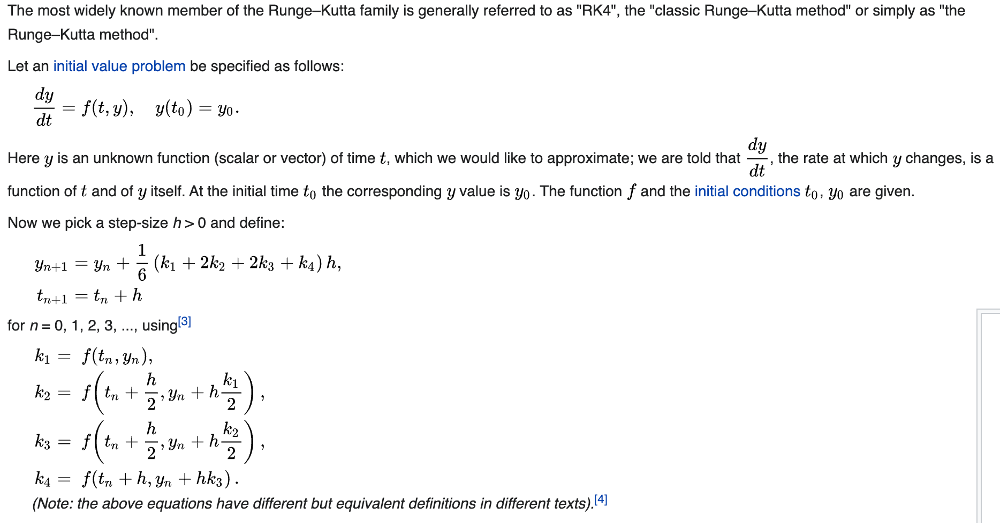

它的关键为`Physics::step(real_t dt)`中将时间步`h=dt`拆为更细的四段分别按照上面总结出的1-4步骤更新，每次求解一个子时间步都重新从环境交互开始重算到解出该子时间步的位置和朝向，这样可以降低时间步`dt`过大时显式求解初值问题的误差问题。但是本次实验的场景非常简单，初值问题就是在求解受力和扭矩与位置和朝向之间的关系，并非高维非线性方程，因而不用RK4误差就能维持在非常小的范围。如果想实现RK4，可以参考[该实现](https://github.com/mahardiansyahkartika/Computer-Graphics)。

最终实现结果如`videos/`文件夹下的录屏，以下为部分截屏。

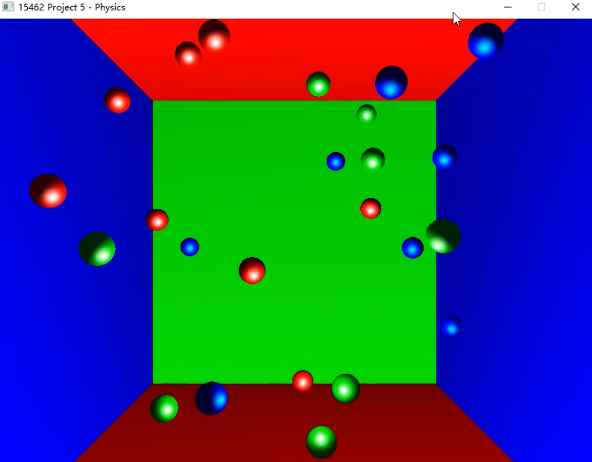

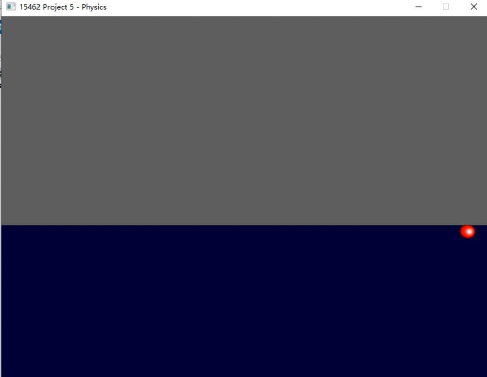

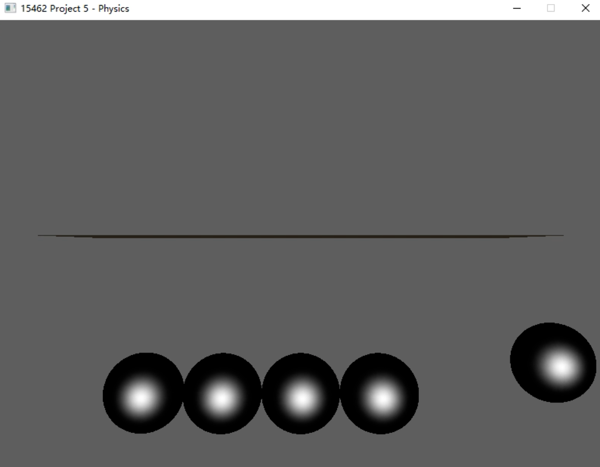

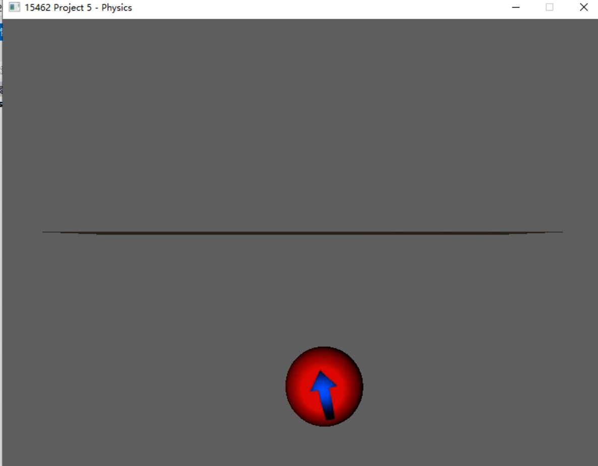

### A-4网格加密

网格加密作业参考了[CMU相关课程的Slide](http://www.cs.cmu.edu/afs/cs/academic/class/15462-s14/www/lec_slides/Subdivision.pdf)和[本博客](https://blog.csdn.net/Mahabharata_/article/details/77585393)，实现Loop Subdivision，下面是根据Slide总结了本次作业和我的实现要点：

- 新加入的顶点叫奇顶点odd vertex，原有粗网格的顶点叫做偶顶点even vertex，生成细网格需要计算奇偶两类顶点的新位置。顶点也分为内在Interior和边界Boundary两类顶点，某条边的两个面形成的夹角过于锋利（本作业中以150°夹角视为锋利），则视为边界边。
- 奇顶点的更新公式为（沿用Slide中的符号定义）：
  - 内在顶点`v=3/8*(a+b)+1/8*(c+d)`
  - 边界顶点`v=1/2*(a+b)`
- 偶顶点的更新公式为：
  - 内在顶点`v=v*(1-k*β)+sum(neighbor)*β`
  - 边界顶点`v=1/8*(a+b)+3/4(v)`
- **算法流程：**
  1. 建立粗网格的数据结构，数据结构要方便维护和访问每个顶点的邻居、所在边、所在面；
  2. 根据更新公式计算奇顶点位置；
  3. 根据更新公式计算偶顶点位置；
  4. 类似步骤1建立细网格的数据结构。

最终实现结果如`videos/`文件夹下的录屏，以下为部分截屏。

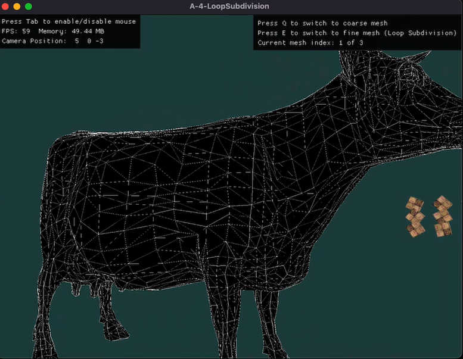

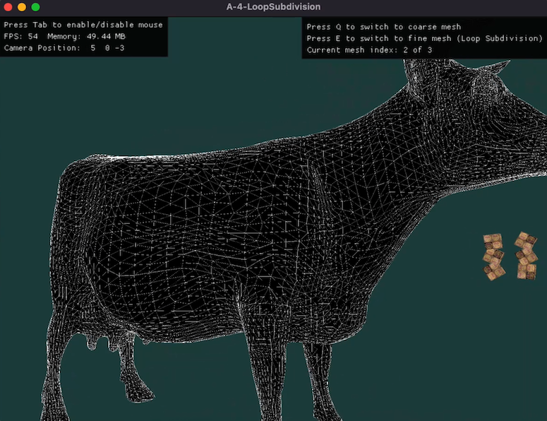

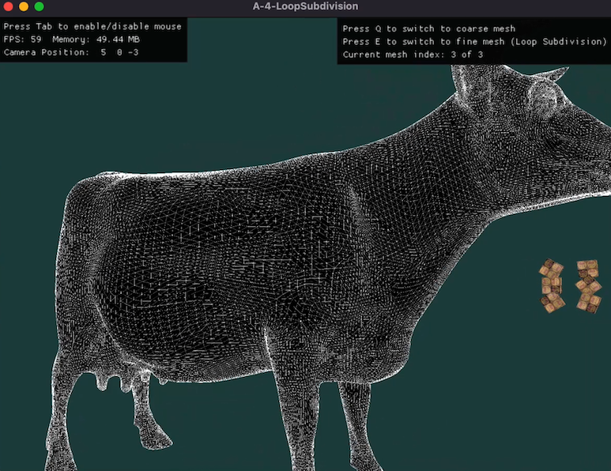

### A-5光线追踪

本作业参考了[ShuchangXu](https://github.com/ShuchangXu/ComputerGraphics)和[zsyzgu](https://github.com/zsyzgu/photon-mapping)，实现有以下要点：

- 光线追踪算法，包括光影Blur的实现。Blur使用随机数对光线的追溯进行随机偏移，这样就可以做到模糊反射的效果；
- 实现Primitive，如Square、Plane、Cylinder和Bezier spinar的光束碰撞。前两个物体较为简单。圆柱体Cylinder参考了[本stackoverflow](https://stackoverflow.com/a/9837645)实现侧面圆柱的碰撞。最后的Bezier spinar在数天的时间里找不到比较好的参考资料（论文等），本作业并没有实现。
- 实现Light，如SphereLight和SquareLight。如果要做虚幻的模糊软阴影边界（类似于Blur的模糊反射），这两个光线的光源需随机在光源体积内选一个位置，然后类似于点光源PointLight进行追溯；如果要做硬阴影边界，则按某种规则在光源体内按点光源追溯即可。

最终实现结果如`videos/`文件夹下的录屏，以下为部分截屏。第一幅图是原始图片（`picture-default.bmp`），第二幅图是实现的硬反射（`picture-noblur.bmp`），第三幅图是软反射（`picture.bmp`）。这三幅图也可以在代码`Code/raytrace_hw`下找到。这三幅图没有展示平面和球光源的示例，但这两者的效果都实现了正确的代码，可以在scene文件中添加即可。

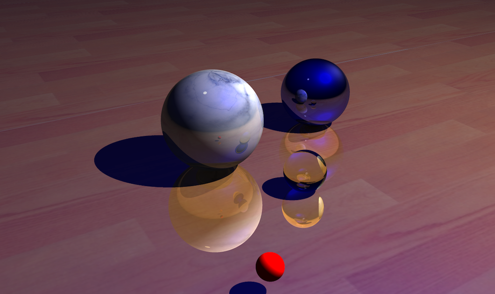

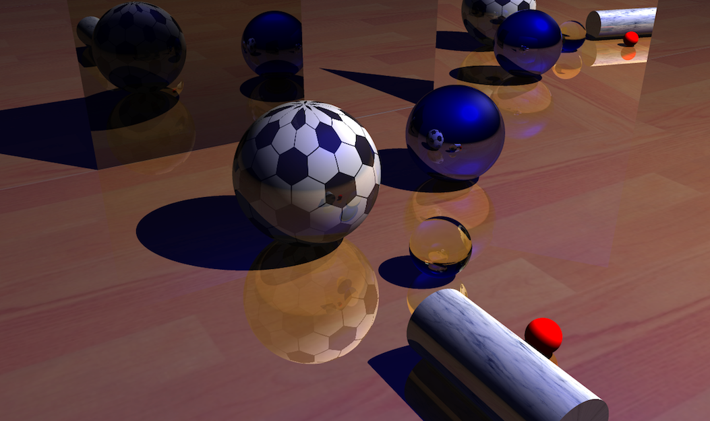

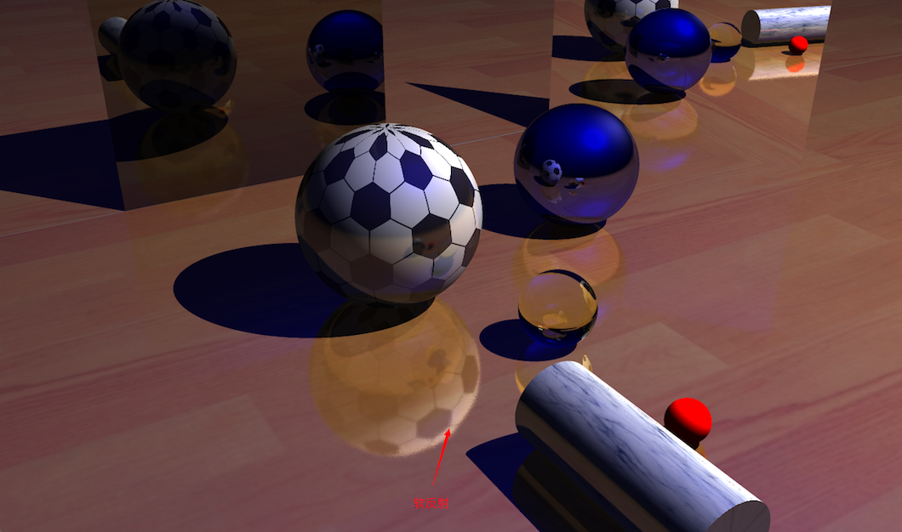

### A-6山体贴图

这是本人在本课程中最早实现的作业，甚至早于任何C与B类作业。其框架一路学习参考了LearnOpenGL的Getting Start，最终也应用到了A-4网格加密作业中。

- 山体加载：参考了LearnOpenGL的Guest Articles→2021年→[Tessellation教程](https://learnopengl.com/Guest-Articles/2021/Tessellation/Height-map)。在此基础上添加了细节纹理，使得靠近观察时能看到更清晰的纹路；
- 天空盒：参考了LearnOpenGL的Getting Start→Textures和一系列文章，并通过旋转实现了各面天空的自然拼接。水面实现了随时间移动的效果，看起来类似水在波动，而且将天空盒与山体在水面之下二次倒映渲染，实现水面的反射效果。

本作业最为直接简单，最终实现结果如`videos/`文件夹下的录屏，以下为部分截屏。第一幅图展示了水面的倒影等效果；第二幅图展示了天空盒的拼接（看起来会因为小而失真，在代码里设置`skyBoxWidth=1e5`就更真实了，但是水面会因为浮点误差与山体出现z-fighting，深度测试出现问题）；第三附图展示了山体的细节纹理。

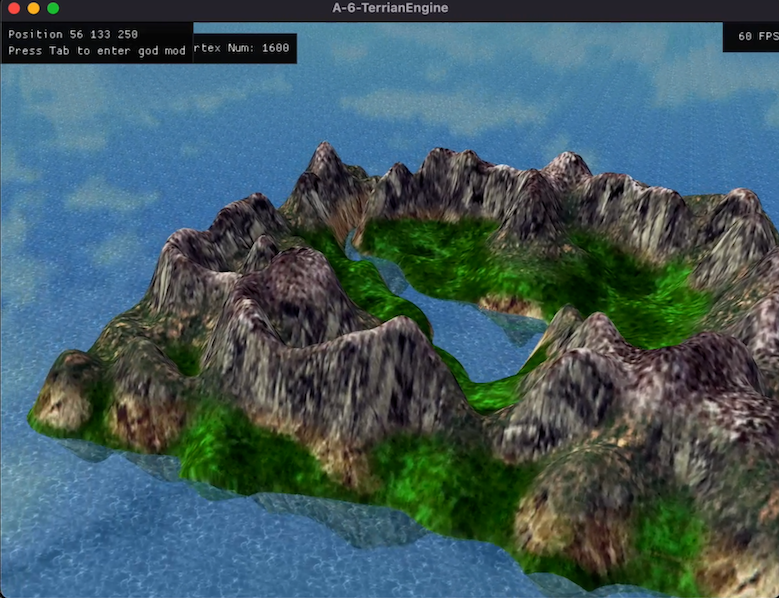

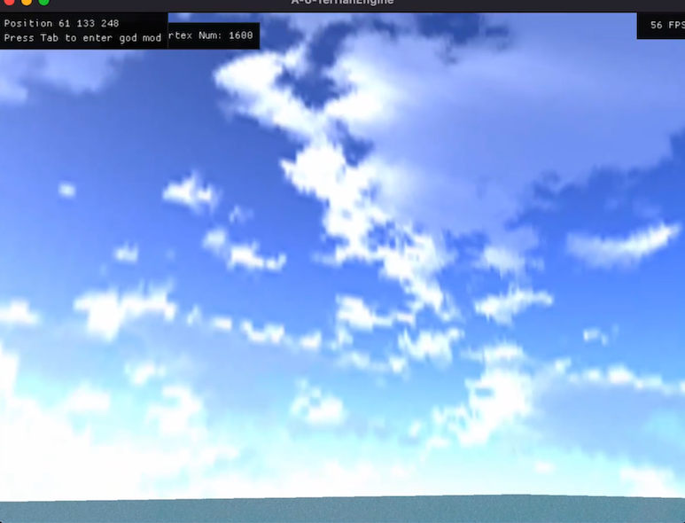

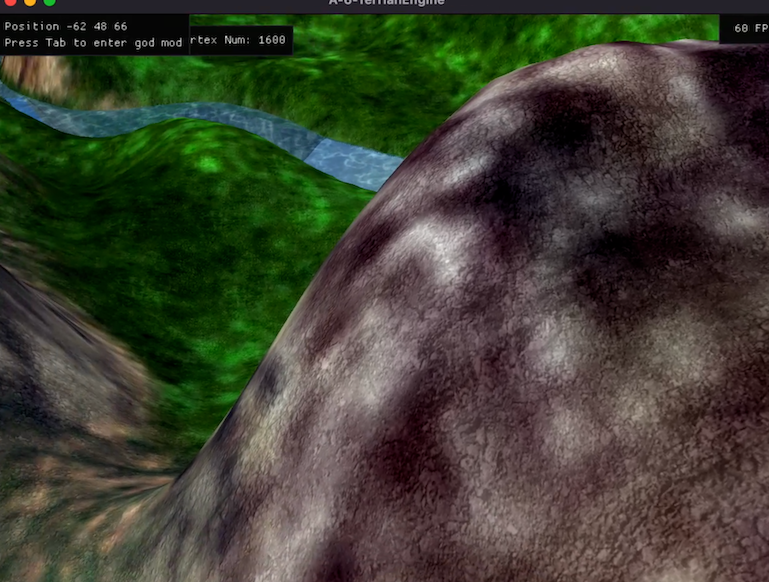

### B-5雪花粒子

本作业参考了[CSDN博客](https://blog.csdn.net/qq_31615919/article/details/78971275)对TransformFeedback渲染雪花的教程。实现了以下功能：

- 粒子效果（每个粒子的更新通过TransformFeedback由GPU计算，提高计算效率）；
- 粒子大小不一，方向各异；
- 开始时雪花较少，随着时间慢慢增多。

代码实现使用了自己搭建的一个框架，本作业主要添加了`SnowSystem.hpp`和`assets/`下的Shader（包括TransformFeedback Shader）。代码命名比较直白，易于理解。主要逻辑是在update时调用UpdateShader计算，而render时调用RenderShader计算。

在UpdateShader的`update.gs`中，有三个主要函数：

- `emitBaseSnow`：这是开始时的主雪花粒子，当他们寿命为0时会重置高度，并且生成一个次雪花粒子；
- `emitDerivedSnow`：这是派生的次雪花粒子，从而实现随时间雪变大的效果；
- `emitRenewDerivedSnow`：次雪花粒子寿命为0时进行重置。

视频如`videos/`文件夹下的录屏，截屏如下：

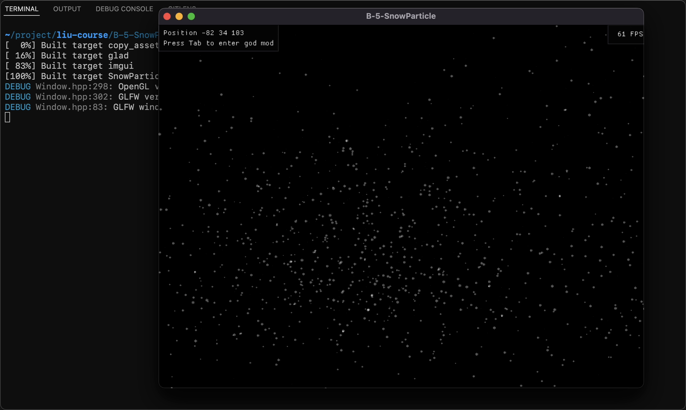

### C-1简单三角形

本作业比较简单，参考LearnOpenGL的Getting Start。实现中使用Dear ImGUI制作了一个Color Picker，右键即可打开和关闭Color Picker。

视频如`videos/`文件夹下的录屏，截屏如下：

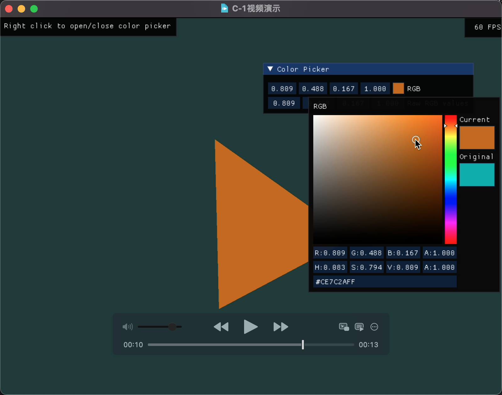

